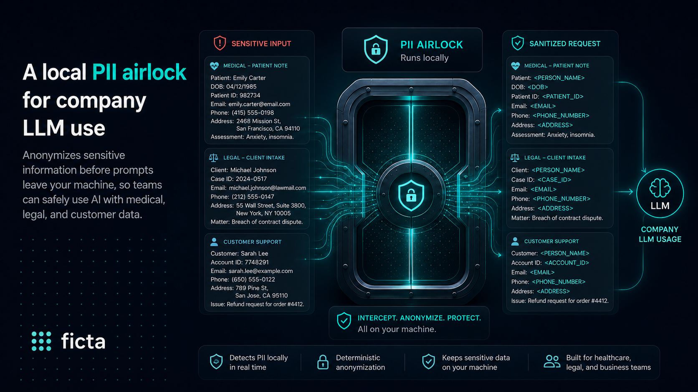

# ficta

[Website](https://ficta.sh)

ficta is a local redaction gateway for model traffic. It can run as a secret airlock for supported
coding agents, or as the proxy behind the included internal web chat for sensitive-data-aware
conversations. In both cases, ficta tokenizes protected values before requests leave your machine or server, then
restores the real values locally on the way back.

The strongest guarantee is still exact-match protection for registered secrets you already manage in
`.env`, process env, or Doppler: if one would be sent verbatim in a surface ficta redacts, ficta
blocks the request instead of forwarding it. PII detection is available as an opt-in, best-effort
detector layer for web/chat use cases; request-time secret-shape detection can also catch newly
pasted API keys, JWTs, private keys, and credential URLs that were not preloaded from env/Doppler.
Both detector layers reduce exposure, but are not completeness guarantees. The exact boundary and
deliberate exceptions are scoped in the
[threat model](packages/ficta/docs/threat-model.md).

## Who it's for

- Individual developers using the coding agents ficta supports today — **Claude Code**, **Codex**,
  and **Pi** — who do not want real keys copied into provider request logs or long-lived model
  context.
- Small teams piloting an internal chat assistant where users paste sensitive text and want a local
  gateway to tokenize registered secrets, best-effort detected secret shapes, and best-effort detected
  PII before OpenAI/Anthropic see them, while restoring those values in the answer shown to the user.

ficta is secret-hygiene and best-effort PII-reduction tooling. It is **not** enterprise DLP, a
compliance product, or a sandbox.

## Quick start — ficta

```sh
npm install -g @steflsd/ficta@beta
# or: pnpm add -g @steflsd/ficta@beta  /  bun install --global @steflsd/ficta@beta
```

```sh
ficta setup              # configure ~/.ficta/config.toml; optionally install shims
ficta doctor claude      # or: codex / pi
# restart your shell if setup installed shims
claude                   # now runs through ficta
```

No shim install:

```sh
ficta claude             # or: ficta codex / ficta pi
```

Full install and usage docs live in the package README:
**[`packages/ficta/README.md`](packages/ficta/README.md)**.

## Quick start — Ficta Gateway



The workspace also includes **[`apps/gateway`](apps/gateway)**, a self-hosted TanStack Start chat UI
for internal sensitive model access. The browser talks to the app's `/api/chat` route; the server
route builds an OpenAI or Anthropic adapter with `baseURL` pointed at the ficta proxy
(`FICTA_PROXY_URL`). Provider API keys stay server-side, auth headers pass through the proxy to the
vendor, and request bodies are redacted/restored by ficta: exact registered secrets, enabled
secret-shape detections, and enabled PII detections all use the same local tokenize-on-egress /
restore-on-response path.

```txt
browser → apps/gateway /api/chat → ficta proxy → OpenAI / Anthropic
                         redact/tokenize      restore on response
```

Local gateway POC run:

```sh
pnpm install
cp apps/gateway/.env.example apps/gateway/.env
# edit apps/gateway/.env and set OPENAI_API_KEY and/or ANTHROPIC_API_KEY
pnpm dev
# open http://localhost:4747
```

This source-checkout path is for local evaluation and design-partner POCs, **not production as-is**:
it defaults to open local auth (`AUTH_PROVIDER=none`), embedded PGlite storage, local `.env`
configuration, and source-checkout sidecar management. For a firm deployment, use real auth,
Postgres, explicit sidecars, monitored logs, retention policy, and provider/legal review. The
operator guide lives in **[`apps/gateway/README.md`](apps/gateway/README.md)**.

## What ficta protects

ficta has three protection layers with different guarantees:

- **Registered secrets (strong exact match):** protects registered values in their verbatim form after
  registry filters and exclusions; redacts covered request bodies, query strings, and non-auth
  headers; fail-closes if a protected value survives redaction in a surface ficta is supposed to
  redact; and restores placeholders locally on model responses.
- **Detected secret shapes (best effort):** optionally detects known token/key formats at request
  time, including common API keys, JWTs, private keys, credential URLs, and secret-ish assignments
  such as `API_TOKEN=...`. This catches newly pasted values that were not in env/Doppler, but it is
  pattern-based and does not verify credentials.
- **Detected PII (best effort):** optionally detects PII at request time, tokenizes detected spans on
  egress, and restores them on response. The built-in backend is high-precision regex detection for
  emails, US SSNs, and Luhn-valid card numbers; Microsoft Presidio is a first-class supported sidecar
  backend for broader NER-style detection such as names, locations, organizations, and phones. The
  source-checkout dev wrapper can manage a local Docker sidecar; production deployments should run
  Presidio as an explicit sidecar.

By default, registered-secret discovery loads values from `.env` / `.env.local`, Doppler's current
config (when the Doppler CLI is available), and secret-ish process env names such as `KEY`, `TOKEN`,
`SECRET`, `PASSWORD`, `AWS`, `OPENAI`, etc.

PII and secret-shape detector defaults are deliberately per surface: the standalone/web proxy follows
`[pii] enabled` and `[secret_shapes] enabled`, while launched coding agents keep those detector layers off
unless the matching `agents` toggle is true (`FICTA_PII_AGENTS` / `FICTA_SECRET_SHAPES_AGENTS`) or the
effective `FICTA_*_ENABLED` env var is explicitly set for that one run.

### What it does not protect

ficta does not claim full prompt privacy, complete secret/PII discovery, or full DLP coverage. Out of
scope: unregistered values that do not match a known shape, transformed values
(base64/URL-encoded/split secrets), PII the detector misses,
secrets or documents the agent sends itself through tool execution / `curl` / MCP tools, binary
responses, and arbitrary non-model network egress. See the
[threat model](packages/ficta/docs/threat-model.md) for the full boundary.

## Supported agents

| Agent | Status | Notes |
| --- | --- | --- |
| Claude Code | Verified | Uses Anthropic base URL routing. |
| Codex | Verified | Supports API-key and ChatGPT/OAuth flows. |
| Pi | Verified | Routes built-in `anthropic`/`openai`/`openai-codex` providers via an ephemeral `PI_CODING_AGENT_DIR` + `models.json` base-URL override. |

ficta only supports CLI agents that route **all** of their model traffic through its proxy. **IDE
clients such as Cursor are not supported** — their agentic features bypass a custom base URL, so
secrets could reach the provider unredacted. See the
[threat model](packages/ficta/docs/threat-model.md#ide-clients-cursor-etc).

## What's in this repo

This is a monorepo. The published package is the `ficta` CLI/proxy; the web app is the internal
sensitive-data chat surface that exercises the same proxy.

- **[`packages/ficta`](packages/ficta)** — [`@steflsd/ficta`](https://www.npmjs.com/package/@steflsd/ficta),
  the CLI, redaction proxy, registry sources, agent integrations, and PII detector backends. This is
  the product published to npm.
- **[`apps/gateway`](apps/gateway)** — Ficta Gateway, a self-hosted TanStack Start chat UI that routes
  every model call through the ficta proxy so registered secrets, best-effort detected secret shapes,
  and best-effort detected PII are tokenized before the vendor and restored on the way back. Includes
  server-side BYO OpenAI/Anthropic keys, chat history/settings storage, optional WorkOS
  auth/workspaces, protection-status polling, and text/document attachments.

## Documentation

- [`packages/ficta/README.md`](packages/ficta/README.md) — full CLI/proxy install, usage, and commands
- [`apps/gateway/README.md`](apps/gateway/README.md) — Ficta Gateway setup, POC defaults, and deployment cautions
- [`docs/install.md`](packages/ficta/docs/install.md) — ficta shim installation and runtime behavior
- [`docs/threat-model.md`](packages/ficta/docs/threat-model.md) — exact promise, covered surfaces, and non-goals
- [`docs/plugins.md`](packages/ficta/docs/plugins.md) — registry-source, detector, and agent-integration plugins
- [`docs/plugins.md#built-in-detector-plugin-secret-shapes`](packages/ficta/docs/plugins.md#built-in-detector-plugin-secret-shapes) — request-time secret-shape detector surfaces and limits
- [`docs/plugins.md#built-in-detector-plugin-pii`](packages/ficta/docs/plugins.md#built-in-detector-plugin-pii) — PII detector surfaces, backends, and failure policy
- [`docs/codex-oauth-intercept.md`](packages/ficta/docs/codex-oauth-intercept.md) — Codex ChatGPT/OAuth routing
- [`docs/benchmarks.md`](packages/ficta/docs/benchmarks.md) — performance notes
- [`CONTRIBUTING.md`](packages/ficta/CONTRIBUTING.md) — contributing to core and extension seams
- [`SECURITY.md`](packages/ficta/SECURITY.md) — reporting vulnerabilities and expected limitations

## Status

ficta is pre-1.0 beta software. The core exact-match redaction, restore, and fail-closed behavior is
covered by tests and local agent runs, but early CLI users should run `ficta doctor <agent>` before
relying on it. The web UI is an internal sensitive-data gateway pilot surface; run live checks with
fake PII and fake secret-shaped tokens using your own provider key before sensitive workflows.

## Development

```sh
pnpm install
pnpm dev         # proxy + web; auto-uses Doppler when configured, otherwise local .env
pnpm dev:proxy   # proxy only
pnpm gateway:dev     # web UI only
pnpm check       # biome
pnpm typecheck
pnpm test
pnpm build
```

`pnpm dev` is for developing the proxy + web UI together. The coding agents don't use it — `ficta
claude|codex|pi` starts its own ephemeral proxy per launch (see
[`docs/install.md`](packages/ficta/docs/install.md)).

## License

This monorepo is dual-licensed by product — see [`LICENSING.md`](LICENSING.md) for the map:

- **`packages/ficta`** (the published `@steflsd/ficta` engine + CLI) — **MIT**, see [`packages/ficta/LICENSE`](packages/ficta/LICENSE).
- **`apps/gateway`** (the sensitive-data chat gateway) — **AGPL-3.0-only**, with a commercial license available; see [`apps/gateway/LICENSING.md`](apps/gateway/LICENSING.md).
